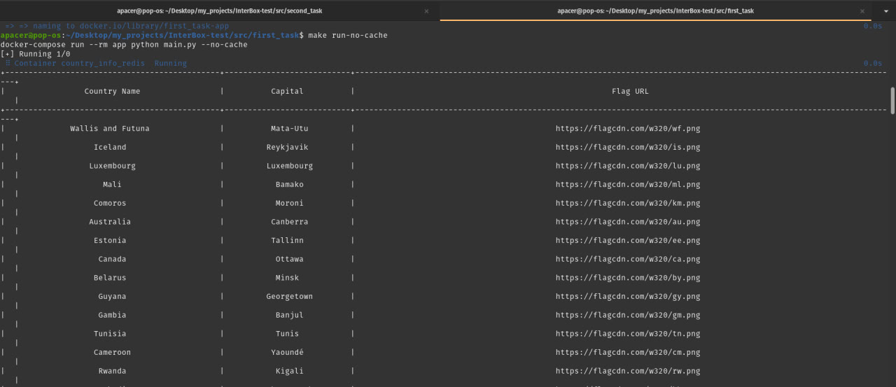
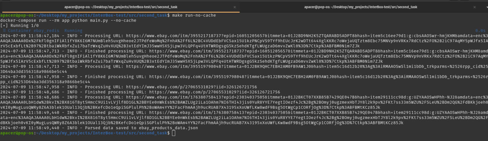
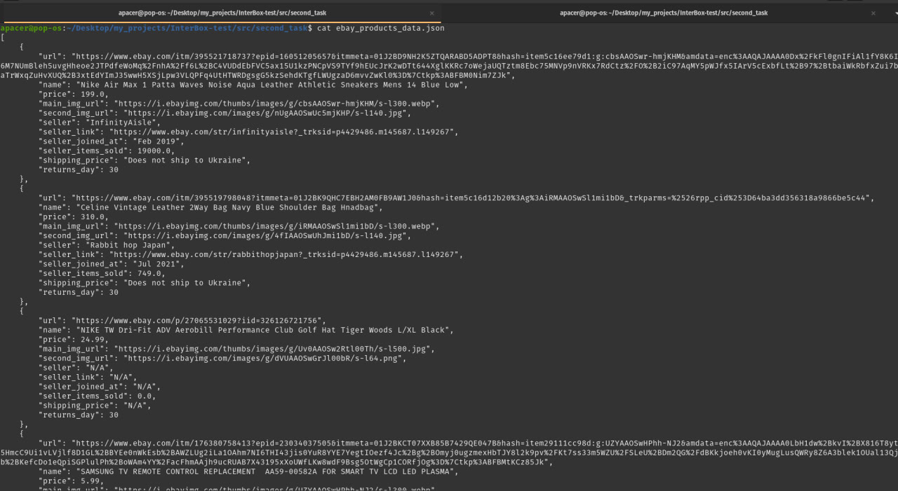

# Тестове Завдання для [InterBox]

## Опис

Цей репозиторій містить два завдання, що входять до тестового завдання для вакансії на [Work.ua](https://www.work.ua/jobs/5733831/).

## Структура Репозиторію

- `src/first_task` - Перше завдання
- `src/second_task` - Друге завдання

### Завдання 1: Взаємодія з API

У папці `src/first_task` знаходиться реалізація класу, який взаємодіє з API [Rest Countries](https://restcountries.com). Клас отримує дані від API та виводить їх у консоль у табличній формі. Дані включають:

- Назва країни
- Назва столиці
- Посилання на зображення прапору у форматі PNG

### Завдання 2: Збір даних зі сторінки Ebay

У папці `src/second_task` знаходиться реалізація класу, який збирає дані зі сторінки товару на Ebay. Дані повертаються у форматі JSON. Обов’язкові дані включають:

- Назва товару
- Посилання на фото
- Посилання на товар
- Ціна
- Продавець
- Ціна доставки

## Використання

### Завдання 1

<div align="center">
  <a href="https://github.com/YuriiDorosh/InterBox-test">
    
  </a>
</div>

1. Перейдіть до папки `src/first_task`.
2. Запустіть скрипт для отримання даних від API Rest Countries.
3. Переконайтеся, що виведені дані включають назву країни, назву столиці та посилання на зображення прапору.

### Завдання 2

<div align="center">
  <a href="https://github.com/YuriiDorosh/InterBox-test">
    
  </a>
</div>

<br>

<div align="center">
  <a href="https://github.com/YuriiDorosh/InterBox-test">
    
  </a>
</div>

1. Перейдіть до папки `src/second_task`.
2. Запустіть скрипт для збору даних зі сторінки Ebay.
3. Переконайтеся, що дані виводяться у форматі JSON та включають обов’язкові поля.

## Вимоги

- Python 3.10+
- Встановлені бібліотеки для роботи з API та парсингом веб-сторінок або [Docker](scripts/install_docker_make_git.sh)

## Встановлення

1. Клонуйте репозиторій:
   ```bash
   git clone https://github.com/YuriiDorosh/InterBox-test
   ```

2. Перейдіть до відповідної папки:
    ```bash
    cd InterBox-test/src/first_task
    ```

3. Встановіть необхідні залежності(якщо Docker - make build, make run-cache/run-no-cache):
    ```bash
    sudo apt install redis-server
    pip3 install -r requirements/requirements.txt
    ```
